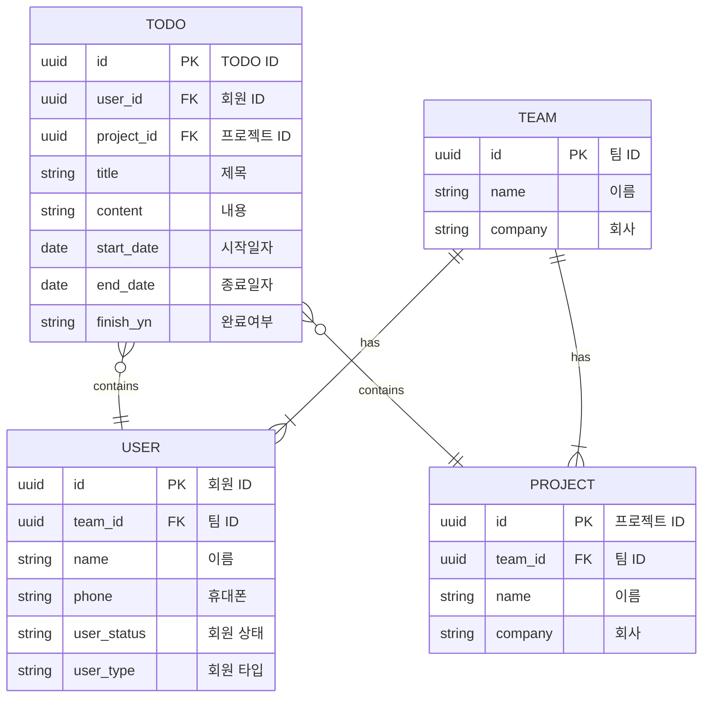

# ERD

```mermaid

erDiagram
    USER{
        uuid id PK "회원 ID"
        uuid team_id FK "팀 ID"
        string name "이름"
        string phone "휴대폰"
        string user_status "회원 상태"
        string user_type "회원 타입"
    }
    TODO {
        uuid id PK "TODO ID"
        uuid user_id FK "회원 ID"
        uuid project_id FK "프로젝트 ID"
        string title "제목"
        string content "내용"
        date start_date "시작일자"
        date end_date "종료일자"
        string finish_yn "완료여부"
    }
    TEAM {
        uuid id PK "팀 ID"
        string name "이름"
        string company "회사"
    }
    PROJECT {
        uuid id PK "프로젝트 ID"
        uuid team_id FK "팀 ID"
        string name "이름"
        string company "회사"
    }

    TODO }o--|| USER : contains
    TODO }o--|| PROJECT : contains
    TEAM ||--|{ USER : has
    TEAM ||--|{ PROJECT : has
```
