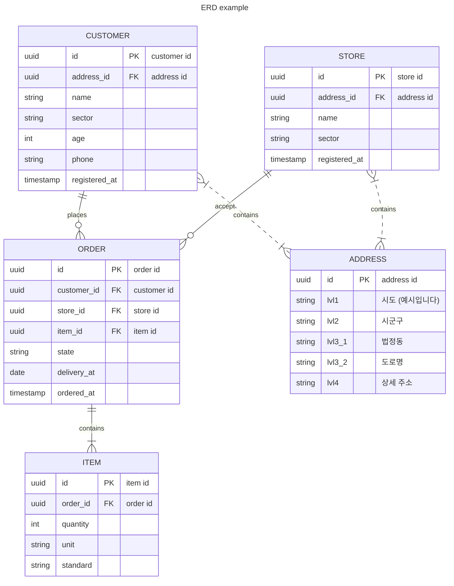

# mermaid_test

```mermaid
---
title: ERD example
---
erDiagram
    CUSTOMER ||--o{ ORDER : places
    CUSTOMER{
        uuid id PK "customer id"
        uuid address_id FK "address id"
        string name
        string sector
        int age
        string phone
        timestamp registered_at
    }
    ORDER {
        uuid id PK "order id"
        uuid customer_id FK "customer id"
        uuid store_id FK "store id"
        uuid item_id FK "item id"
        string state 
        date delivery_at
        timestamp ordered_at
        
    }
    CUSTOMER }|..|{ ADDRESS : contains
    ADDRESS {
        uuid id PK "address id"
        string lvl1 "시도 (예시입니다)"
        string lvl2 "시군구"
        string lvl3_1 "법정동"
        string lvl3_2 "도로명"
        string lvl4 "상세 주소"
    }
    STORE ||--o{ ORDER : accept
    STORE {
        uuid id PK "store id"
        uuid address_id FK "address id"
        string name
        string sector
        timestamp registered_at
    }
    STORE }|..|{ ADDRESS : contains
    ORDER ||--|{ ITEM : contains
    ITEM {
        uuid id PK "item id"
        uuid order_id FK "order id"
        int quantity
        string unit
        string standard
    }
```
